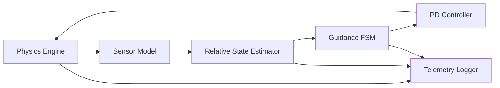
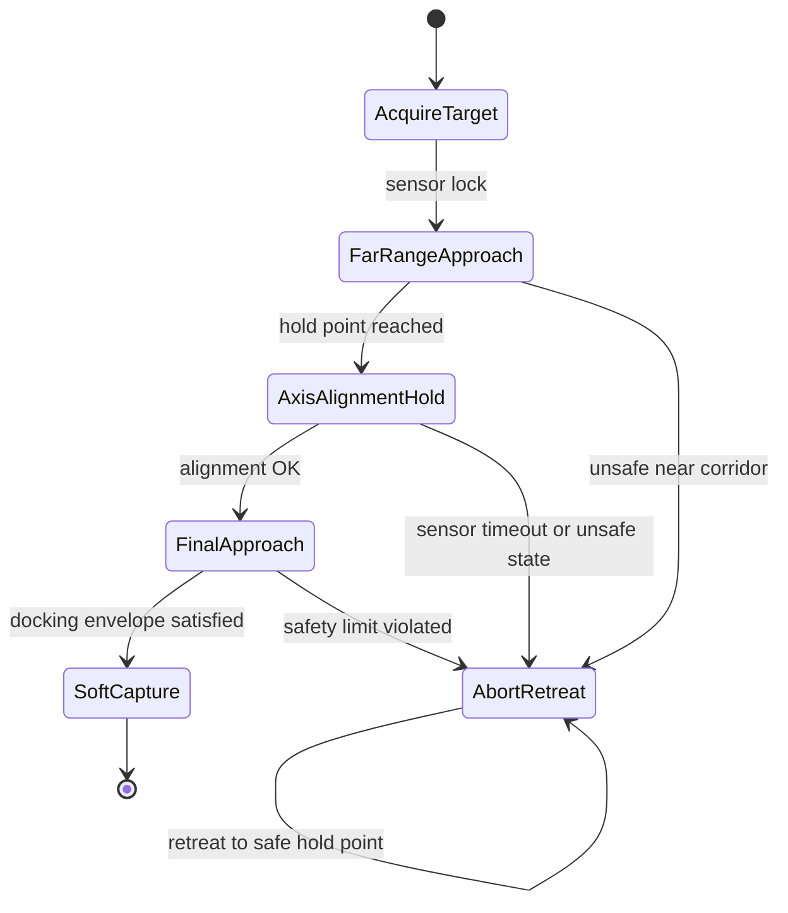

# Spacecraft Docking Simulation Report

## Project Goal

This project simulates autonomous spacecraft docking in a microgravity environment for a robotics subject. A chaser vehicle estimates its relative pose with respect to a moving target station, aligns with the target docking port, matches the station's translational and angular motion, and performs an autonomous final approach while respecting safety constraints.

## System Architecture

## Autodocking State Machine

## Microgravity Model

- The simulation is local to the docking zone and uses relative motion between a chaser spacecraft and a moving target station.
- Gravity is omitted because the objective is close-range docking behavior rather than orbital rendezvous.
- No atmospheric drag, wheel contact, or ground friction is included.
- The chaser is modeled as a rigid body with translational and rotational dynamics.
- The target station drifts with a commanded linear velocity and rotates with a slow angular rate.
- Body-frame thruster forces and torques are saturated to realistic limits and include small actuator noise.

## Navigation and Estimation

- Relative position is measured between the chaser docking ring and the target docking port through a simulated vision or lidar-style pose sensor.
- Relative orientation is measured through a noisy docking-marker pose estimate.
- Relative angular velocity is measured through a noisy IMU-style rate signal.
- The estimator smooths position and velocity and blends attitude measurements to reduce noise while staying lightweight enough for a classroom project.

## Guidance and Control

- Guidance is implemented as a finite-state machine with six phases:
  - Acquire Target
  - Far-Range Approach
  - Axis Alignment Hold
  - Final Approach
  - Soft Capture
  - Abort / Retreat
- Translational control is a PD controller in the target frame.
- Attitude control is quaternion-based PD control.
- During final approach, the desired axial position moves slowly toward the docking plane while lateral error is driven to zero and the chaser matches the target station's motion.

## Docking Success Conditions

Docking is declared only when all conditions hold simultaneously:

- Relative distance <= `0.10 m`
- Lateral alignment error <= `0.03 m`
- Angular error <= `5 deg`
- Closing speed <= `0.05 m/s`
- Relative angular rate <= `2 deg/s`

If these constraints are violated near the docking corridor, the spacecraft transitions to an abort/retreat mode and backs away to a safe hold point.

## Evaluation Scenarios

- Nominal docking
- Offset start
- Sensor noise
- Actuator saturation
- Unsafe closing speed
- Large misalignment
- Sensor blackout during approach

## Limitations and Extensions

- The station motion is prescribed rather than driven by a second controller.
- The simulation uses simplified local microgravity dynamics rather than full orbital mechanics.
- The estimator is a filtered measurement fusion block, not a full EKF.
- Future work could add moving targets, 6DOF orbital-relative motion, a Kalman filter, or a ROS 2 / Gazebo interface.
